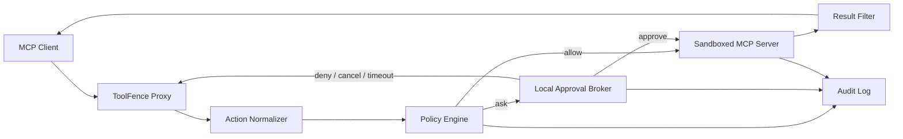

# ToolFence 开发手册

本文档是 ToolFence 的产品设计、架构约束和开发路线基线。README 面向使用者；本文档面向维护者和贡献者。

当前实现版本为 `0.2.1`。本手册中的第二阶段验收标准记录了首个稳定开源版本的发布门槛；`0.2.1` 在不改变策略语义的前提下补充脚本化审批、审计检查与覆盖率门槛。

## 1. 最终设计构想

### 1.1 产品定位

ToolFence 是一个本地优先、确定性决策的 Agent 工具权限网关。它位于 MCP 客户端与 MCP Server 之间，在工具调用产生副作用之前完成：

1. 协议接收与透传。
2. 工具调用语义标准化。
3. 策略判断。
4. 必要时人工审批。
5. 调用审计和结果关联。
6. 后续阶段的进程、文件系统与网络隔离。

ToolFence 不使用大模型参与权限决策。相同输入、策略与状态必须产生相同结果，所有结果必须可解释。

### 1.2 用户价值

- 阻止 Agent 因误判、提示注入或上下文污染读取敏感文件、执行危险命令或访问未授权网络。
- 让用户知道一次工具调用将访问什么、由哪条规则决定，以及最后是否真正执行。
- 为不同 MCP Server 提供统一的最小权限策略，而不是依赖每个 Server 各自实现安全控制。
- 默认本地保存策略、审批和审计数据，不要求云账户或远程服务。

### 1.3 设计原则

1. **默认关闭**：无法识别、无法审批、超时或内部失败时拒绝执行。
2. **显式拒绝优先**：任何匹配的 `deny` 都覆盖 `allow` 和 `ask`。
3. **确定性**：核心决策路径不得依赖大模型或概率判断。
4. **最小披露**：审批和审计只传递判断所需的标准化字段，不记录原始参数和原始结果。
5. **边界诚实**：调用代理与进程沙箱是两层不同的安全边界，文档和界面不得混淆。
6. **协议透明**：除明确拦截的 `tools/call` 和相关取消消息外，代理不改变合法 MCP 消息。
7. **可解释**：每次决定都包含规则 ID、理由和最终结果。
8. **适配器保守**：适配器只能提高识别精度；识别失败必须降级为 `unknown`，不能自动放行。

### 1.4 最终目标架构



组件职责：

- **Proxy**：维护 MCP/JSON-RPC 生命周期、请求关联、取消和上游进程状态。
- **Normalizer**：把 Server 特有的工具名和参数转换为标准动作。
- **Policy Engine**：执行无副作用、可复现的策略匹配。
- **Approval Broker**：在无控制终端的 MCP Host 中提供本地审批、超时和会话授权。
- **Sandbox**：限制上游 Server 进程的环境变量、文件系统和网络能力。
- **Result Filter**：在返回客户端前进行可配置的高置信度敏感信息过滤。
- **Audit**：保存标准化动作、最终决定、结果摘要和生命周期事件。

### 1.5 标准动作模型

最终动作命名空间：

```text
fs.read
fs.write
fs.delete
shell.exec
git.read
git.write
git.remote
net.request
unknown
```

目标 `NormalizedAction`：

```ts
interface NormalizedAction {
  operation: Operation;
  resources: string[];
  server: string;
  tool: string;
  executable?: string;
  argv?: string[];
  network?: {
    url: string;
    host: string;
    method: string;
  };
}
```

原始工具参数只在当前进程内用于标准化，不进入 Broker 消息或审计文件。

### 1.6 威胁模型

ToolFence 最终应处理以下威胁：

- Agent 被网页、邮件、文档或工具结果中的提示注入影响。
- Agent 错误理解用户目标并调用高风险工具。
- 工具调用尝试路径穿越、符号链接逃逸或混合安全与敏感资源。
- Shell 参数包含复合命令、重定向或命令替换。
- MCP Server 的工具 Schema 在升级后发生未确认变化。
- Agent 尝试访问未授权域名、HTTP 方法或 Git 远端。
- 审批等待期间客户端取消或超时，但调用仍被事后执行。

当前 v0.1 不防御：

- 恶意上游 MCP Server 进程主动读取文件、环境变量或网络。
- 绕过 MCP Proxy 的客户端原生 Shell、文件系统或浏览器能力。
- 操作系统、当前用户账户或 ToolFence 进程本身已被攻破。
- 路径检查完成后、上游实际访问前发生的 TOCTOU 竞争。

这些边界必须保留在 README 和发布说明中，直到对应隔离能力完成并验证。

### 1.7 安全不变量

任何实现变更都不得破坏以下不变量：

1. stdout 只输出 MCP JSON-RPC 消息；诊断和审批提示使用独立通道。
2. 未知工具默认 `ask` 或 `deny`，不能静默 `allow`。
3. 多资源 `allow` 要求所有资源匹配；多资源 `deny` 只需任一资源匹配。
4. 路径在策略判断前必须转换为规范绝对路径并解析已有符号链接。
5. 允许 Shell 命令必须按可执行文件和 argv 精确匹配；不把复合 Shell 字符串视为安全 argv。
6. 客户端取消、审批超时、Broker 失联或上游故障后，不得事后执行调用。
7. 审计文件权限为 `0600`，运行目录和本地 Socket 仅当前用户可访问。
8. 审计和 Broker 不保存原始工具参数、命令参数、密钥或原始结果。
9. 策略文件的未知字段和重复规则 ID 必须导致启动失败。
10. 工具 Schema 首次出现或指纹变化时，不得沿用未确认的会话授权。

### 1.8 长期路线

- **v0.1 — 协议与策略基础**：stdio Proxy、文件/Shell 适配、YAML 策略、TTY 审批、JSONL 审计。
- **v0.2 — 首个稳定开源版（pre-1.0）**：安全加固、本地审批 Broker、Git/HTTP 适配、策略工具、真实集成测试。
- **v0.3 — 进程安全边界**：环境变量白名单、只读/读写挂载、网络白名单、资源限制和 Server 版本锁定。
- **v0.4 — 响应与可观测性**：结果脱敏、审计轮转、OpenTelemetry 导出和 Schema 变更历史。
- **v1.0 — 稳定发布**：跨平台隔离、稳定策略 Schema、兼容性承诺、安全审计和迁移文档。

## 2. 当前 v0.1 基线

当前模块：

| 模块 | 职责 |
|---|---|
| `src/proxy.ts` | stdio JSON-RPC 代理、工具调用拦截和结果关联 |
| `src/adapters.ts` | Filesystem/Shell 动作标准化 |
| `src/policy.ts` | 规则匹配和决定生成 |
| `src/config.ts` | YAML 配置解析与严格校验 |
| `src/approval.ts` | `/dev/tty` 单次审批 |
| `src/audit.ts` | JSONL 决定与结果摘要记录 |
| `src/cli.ts` | `toolfence wrap` 命令入口 |

已实现的策略优先级：

1. 所有匹配的 `deny` 优先。
2. 否则使用配置中第一条匹配规则。
3. 无规则匹配时使用 `default`。

开始第二阶段前必须修复当前审核发现：

- 审批等待期间的取消请求可能无法阻止事后执行。
- 已存在的审计文件不会自动收紧为 `0600`。
- `--` 后的上游 `--help`/`--version` 会被 CLI 误拦截。
- 策略读取和校验错误会直接输出 Node.js 堆栈。

## 3. 第二阶段：v0.2 首个稳定开源版

### 3.1 阶段目标

把 ToolFence 从可运行的 CLI MVP 提升为可由开发者日常使用的本地稳定版本：

- 即使 MCP Host 没有控制终端，也能完成人工审批。
- 取消、超时、上游退出和内部错误不会产生未预期执行。
- Filesystem、Shell、Git 和 HTTP 四类常见动作可以稳定识别。
- 用户能独立校验、测试和解释策略。
- 真实 MCP Server 端到端行为得到 CI 验证。

v0.2 仍不是恶意 Server 的进程沙箱，不得移除相关安全声明。

### 3.2 2A：安全加固门槛

在开发新功能前完成：

1. **取消跟踪**
   - 为待审批请求建立 `requestId -> PendingApproval` 状态。
   - 拦截相关 `notifications/cancelled`。
   - 取消后撤销审批并保证原调用永不转发。
2. **审计权限**
   - 创建或打开审计文件后强制检查权限。
   - POSIX 平台要求 `0600`；无法收紧时启动失败。
3. **CLI 参数边界**
   - ToolFence 只解析第一个 `--` 之前的参数。
   - `--` 后的内容逐字作为上游命令及参数保留。
4. **初始化错误处理**
   - 捕获策略缺失、YAML 错误、Schema 错误、审计路径错误和上游启动错误。
   - stderr 输出单行摘要和可操作建议，不输出默认堆栈。
5. **生命周期可靠性**
   - 处理上游提前退出、stdin 关闭、写入失败、审计失败和悬挂请求。
   - 所有未完成调用以拒绝或明确错误结束。

2A 是后续功能合并和发布 `0.2.0` 的前置门槛。

### 3.3 2B：本地审批 Broker

#### 进程模型

```text
MCP Client → ToolFence Proxy ─┐
MCP Client → ToolFence Proxy ─┼→ Local Broker → Terminal approval UI
MCP Client → ToolFence Proxy ─┘
```

新增命令：

```bash
toolfence broker
toolfence status
toolfence approvals
```

- `broker`：启动当前用户唯一的本地 Broker。
- `status`：检查 Broker、协议版本和 Socket 权限。
- `approvals`：连接 Broker，显示和处理审批队列。

#### 本地传输

- macOS/Linux 使用 Unix Domain Socket。
- Socket 目录权限为 `0700`，Socket 仅当前用户可访问。
- 默认路径为 `${XDG_RUNTIME_DIR:-$TMPDIR}/toolfence-$UID/broker.sock`。
- Broker 创建随机认证 Token，保存到 `~/.toolfence/broker.token`，权限为 `0600`。
- v0.2 不实现 Windows Named Pipe；Windows 保持非交互 fail-closed，并在文档中标为不支持。

#### Broker 协议

使用一行一个对象的版本化 JSON 消息：

```ts
type BrokerMessage =
  | {
      type: "approval.request";
      protocolVersion: 1;
      approvalId: string;
      sessionId: string;
      requestId: string | number | null;
      action: NormalizedAction;
      ruleId?: string;
      reason: string;
      expiresAt: string;
    }
  | {
      type: "approval.resolve";
      protocolVersion: 1;
      approvalId: string;
      decision: "allow-once" | "allow-session" | "deny";
    }
  | {
      type: "approval.cancel";
      protocolVersion: 1;
      approvalId: string;
      reason: "client-cancelled" | "timeout" | "proxy-closed";
    };
```

规则：

- 默认审批超时为 60 秒，超时自动拒绝。
- `allow-once` 只影响当前 request ID。
- `allow-session` 只缓存当前 Server、Tool、标准动作和 Schema 指纹的组合。
- v0.2 不提供“永久允许并自动修改策略”。
- Broker 不接收 `rawArguments` 或原始结果。
- Broker 不可用、认证失败或协议版本不兼容时 fail-closed。

#### 请求状态机

```text
received
  ├─ deny ───────────────→ denied
  ├─ allow ──────────────→ forwarded → completed
  └─ ask → awaiting-approval
             ├─ approve → forwarded → completed
             ├─ reject ─────────────→ denied
             ├─ cancel ─────────────→ cancelled
             └─ timeout ────────────→ denied
```

只有 `allow` 或 `approve` 可以进入 `forwarded`，且 `cancelled`、`denied` 和 `completed` 都是终态。

### 3.4 2C：适配器与策略工具

#### Git Adapter

标准动作：

- `git.read`：status、diff、log、show、branch list。
- `git.write`：add、commit、checkout、merge、rebase、reset。
- `git.remote`：fetch、pull、push、remote mutation。

无法无歧义解析的 Git 命令保持 `shell.exec` 或 `unknown`，不得错误降级为低风险 `git.read`。

#### HTTP Adapter

输出 `net.request`，至少标准化：

- URL
- Host
- HTTP Method
- Scheme

策略规则增加可选字段：

```yaml
hosts: ["api.example.com", "*.internal.example.com"]
methods: [GET, HEAD]
```

- Host 匹配不包含用户信息、端口或路径。
- URL 解析失败时为 `unknown`。
- 重定向后的目标必须重新判断，不能继承原始域名授权。

#### 策略开发命令

```bash
toolfence policy check --policy ./policy.yaml
toolfence policy explain --policy ./policy.yaml --action ./action.json
toolfence policy test --policy ./policy.yaml --cases ./policy-cases.yaml
```

- `check`：验证 YAML、Schema、变量、重复 ID 和明显无效组合。
- `explain`：输出标准动作、匹配规则、优先级和最终决定。
- `test`：批量执行声明式策略用例，任何不一致返回非零退出码。

#### 工具 Schema 指纹

- 在 `tools/list` 响应中对工具名、描述和 `inputSchema` 的规范 JSON 计算 SHA-256。
- 指纹首次出现或发生变化时使相关会话授权失效。
- 静态 YAML 规则仍然有效，但自动会话授权不得跨指纹复用。
- 指纹只表示 Schema 身份，不表示 Server 代码安全。

### 3.5 2D：测试与发布验证

#### 自动测试

必须覆盖：

- `allow`、`deny`、`ask` 和默认决定。
- 多资源规则、路径穿越和符号链接逃逸。
- 简单命令与复合 Shell 命令。
- 审批通过、拒绝、取消、超时和 Broker 断开。
- 多个 Proxy 并发连接和审批队列隔离。
- 上游提前退出、无响应、错误响应和 stderr 输出。
- 审计文件已有不安全权限、目录不可写和磁盘写入失败。
- CLI 分隔符及上游参数保真。
- Git 读写/远程分类。
- HTTP Host、Method、无效 URL 和重定向重新判断。
- Schema 指纹不变、首次出现和变化。

#### 真实集成

至少使用：

- 官方 Filesystem MCP Server。
- 一个可重复执行的 Shell MCP Server fixture。
- 一个本地 HTTP MCP Server fixture。
- 一个 Git 临时仓库 fixture。

集成场景必须包括：

- 正常 `initialize`、`tools/list`、`tools/call` 生命周期。
- 读取 `.env` 被拒绝。
- 工作区外路径和符号链接逃逸被拒绝或审批。
- 混合安全文件与敏感文件的批量读取被拒绝。
- `npm test && curl ...` 不匹配简单命令授权。
- 客户端取消后调用永不抵达上游。
- 无 Broker、Broker 超时和认证失败全部 fail-closed。

#### CI 矩阵

- macOS 与 Linux。
- Node.js 20、22、24。
- `npm run typecheck`
- `npm test`
- `npm run build`
- `npm pack --dry-run`
- `npm audit --omit=dev`

### 3.6 v0.2 验收标准

只有全部满足才能发布 `0.2.0`：

1. 2A 审核问题全部有回归测试并关闭。
2. 无控制终端时可以通过 Broker 完成允许和拒绝。
3. 取消、超时和 Proxy/Broker/上游退出后不会事后执行。
4. Filesystem、Shell、Git、HTTP 四类动作具有保守适配器。
5. 策略可独立校验、解释和执行声明式测试。
6. Schema 变化会清除相关会话授权。
7. 真实 MCP Server 集成测试和 CI 矩阵全部通过。
8. npm 包包含可执行 CLI、示例策略、README 和本手册。
9. 生产依赖审计无高危或严重漏洞。
10. README 明确保留“不是恶意 Server 沙箱”的声明。

### 3.7 v0.2 非目标

为控制范围，第二阶段不实现：

- Docker、bubblewrap 或操作系统级进程沙箱。
- 云端账户、远程审批或团队控制台。
- 浏览器管理界面。
- 自动用大模型生成权限策略。
- 自动永久修改策略文件。
- Windows Named Pipe 和 Windows 进程隔离。
- 对原始结果进行通用敏感信息脱敏。
- MCP Streamable HTTP 代理。

## 4. 下一阶段：v0.3 Cross-Agent Enforcement Baseline

### 4.1 阶段目标

v0.3 的核心任务不是增加另一套审批界面，而是把 ToolFence 从“本地 MCP 审批代理”升级为“跨 Agent 的统一策略执行层”。

阶段承诺是：

> 用户只定义一次安全策略，就能在 Codex、Claude Code、Cursor 等不同 MCP Host 中得到一致、可验证且可审计的执行结果。

所有 v0.3 工作都必须直接支持以下至少一项能力：跨平台决策一致、标准动作稳定、审计证据完整或执行边界更清晰。原生 Host 审批、ToolFence 策略执行和操作系统隔离仍是互补关系，ToolFence 不与 Host 竞争通用审批界面。

### 4.2 4A：跨 Agent 一致执行

- 为 Codex、Claude Code 和 Cursor 维护经过端到端验证的开箱配置。
- 建立跨 Host 一致性测试矩阵，保证同一标准动作和策略在不同 Host 中得到相同的 `allow`、`ask` 或 `deny` 决定。
- 让 `toolfence doctor` 检查已受 ToolFence 保护的 MCP 路径，并明确报告内置 Shell、文件工具或其他可能绕过 Proxy 的能力。
- 发布可机器校验的 Host、操作系统、MCP Transport 和 MCP Server 兼容性矩阵。
- 保持 Host 集成只负责接入，不把 Host 特有行为写入通用策略语义。

验收结果必须证明：同一份策略文件不修改规则即可在三个目标 Host 中复用。

### 4.3 4B：版本化标准动作模型

标准动作模型和 Adapter 是 ToolFence 跨平台复用能力的核心资产。v0.3 必须：

- 为 `fs.read`、`fs.write`、`shell.exec`、`git.read`、`git.write`、`net.request` 等标准动作建立显式版本。
- 定义动作字段、资源语义、兼容性规则和保守降级行为，避免升级时静默改变授权范围。
- 扩展常用 MCP Server Adapter，并为第三方 Adapter 提供最小扩展规范和一致性测试套件。
- 对未知工具、歧义参数、混合资源和无法安全标准化的调用继续 fail closed。
- 在工具 Schema 或 Adapter 语义变化时使相关会话授权失效，并提供策略兼容性诊断。

不得用不透明的大模型风险评分替代确定性的动作标准化和策略匹配。

### 4.4 4C：可证明的统一审计

v0.3 审计应从“存在本地日志”升级为“能够解释和证明跨平台执行结果”：

- 关联 MCP Host、MCP Server、工具名、工具 Schema 指纹、标准动作、策略版本、规则 ID 和最终决定。
- 能回答谁通过哪个 Host 调用了什么能力、影响了哪些资源、依据哪条规则放行或拒绝。
- 保持数据最小化：不记录原始参数、原始结果、凭据或审批秘密。
- 提供稳定的查询与导出格式，供本地分析、CI 和外部审计系统使用。
- 在本地格式稳定后评估哈希链、签名或其他可检测篡改的导出机制。

复杂云端 Dashboard 不是本阶段前置条件；应先稳定证据模型和导出契约。

### 4.5 4D：扩大并说明执行边界

v0.3 应优先减少“用户以为已保护、实际仍可绕过”的差距：

1. 评估并实现不削弱目的地址与重定向检查的 MCP Streamable HTTP 支持。
2. 为上游进程设计最小环境变量传递与敏感变量过滤。
3. 设计文件系统和网络最小权限隔离，作为独立于语义策略的进程沙箱层。
4. 设计高置信度输出敏感信息检测与脱敏，且不得把原始结果写入审计。
5. 对尚未覆盖的 Host 内置工具、Transport 和直接进程能力提供显式诊断。

v0.3 不要求一次完成通用操作系统沙箱，但任何能力声明都必须准确标注覆盖路径和已知绕过面。

### 4.6 产品验证

在建设集中式团队控制台之前，应与 5 至 10 个设计合作团队验证统一策略层是否解决真实问题。优先选择同时使用两种以上 Agent、运行自建或第三方 MCP Server、并有统一权限或审计要求的团队。

需要验证：

1. 团队是否愿意维护独立于 Agent 厂商的策略。
2. 统一策略是否实质减少重复配置和人工审批。
3. 安全或平台团队是否愿意把 ToolFence 的审计结果作为正式证据。

如果以上假设未得到验证，不应以复杂控制台或云端账户体系扩大产品范围。

### 4.7 v0.3 验收标准

v0.3 的北极星指标是：同一份策略在不同 Agent 平台上的决策一致率。

发布前至少满足：

1. Codex、Claude Code 和 Cursor 的目标用例全部通过跨 Host 端到端测试。
2. 所有 `deny`、未知动作和歧义动作测试 100% fail closed。
3. 标准动作模型具有版本、兼容性规则和 Adapter 一致性测试。
4. 新用户可在十分钟内完成首次受保护调用。
5. `toolfence doctor` 能准确报告保护范围、兼容性和主要绕过风险。
6. 审计记录可以完整关联 Host、工具、Schema、策略、规则、决定和结果摘要。
7. 文档中的支持矩阵、安全边界和已知限制与真实实现一致。
8. 至少完成一轮设计合作团队验证并记录结论。

### 4.8 v0.3 非目标

- 不复制各 Agent 平台的通用审批界面。
- 不以大模型黑盒风险评分决定是否执行工具调用。
- 不在本地执行和证据模型稳定前建设复杂云端管理后台。
- 不为追求 Adapter 数量而绕过统一动作规范和回归测试。
- 不宣称 ToolFence 已提供完整 Agent 安全或通用恶意进程沙箱。

## 5. 开发工作流

### 5.1 本地准备

```bash
npm install
npm run typecheck
npm test
npm run build
```

### 5.2 提交要求

- 先写或更新能证明行为的测试，再修改实现。
- 安全语义变化必须同步更新 README、本手册和示例策略。
- 不在同一提交中进行无关重构。
- 新适配器必须包含保守降级测试。
- 新公开字段必须有 Schema 校验和兼容性说明。
- 不提交真实密钥、原始审批数据或审计日志。

### 5.3 完成性检查

```bash
npm run typecheck
npm test
npm run build
npm pack --dry-run
npm audit --omit=dev
```

代码通过测试不代表安全边界已经扩大。只有威胁模型、实现、回归测试和文档同时更新后，才能修改安全能力声明。
