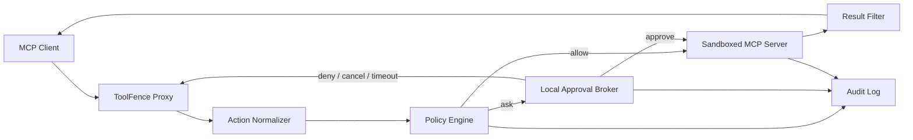

# ToolFence 开发手册

本文档是 ToolFence 的产品设计、架构约束和开发路线基线。README 面向使用者；本文档面向维护者和贡献者。

当前实现版本为 `0.3.4`。第 2、3 节保留 v0.1/v0.2 的历史设计与验收基线；第 4 节记录基于当前实现、安全修复和 MCP 生态变化重新制定的后续路线。公开优先级以 [`ROADMAP.md`](ROADMAP.md) 为准。

与 AgentTape 的双向真实验证遵循 [`docs/AGENTTAPE_TOOLFENCE_ALIGNMENT.md`](docs/AGENTTAPE_TOOLFENCE_ALIGNMENT.md)。开发 ToolFence 时，AgentTape 作为固定版本的伴随观察器记录真实 Codex 失败；该证据补充但不替代 ToolFence 自身的 conformance corpus、`npm run verify` 和发布门槛。

## 1. 最终设计构想

### 1.1 产品定位

ToolFence 是一个本地优先、确定性决策的 Agent 工具权限网关。它位于 MCP 客户端与 MCP Server 之间，在工具调用产生副作用之前完成：

1. 协议接收与透传。
2. 工具调用语义标准化。
3. 策略判断。
4. 必要时人工审批。
5. 调用审计和结果关联。
6. 后续阶段的进程、文件系统与网络隔离。

ToolFence 不使用大模型参与权限决策。相同输入、策略与状态必须产生相同结果，所有结果必须可解释。

### 1.2 用户价值

- 阻止 Agent 因误判、提示注入或上下文污染读取敏感文件、执行危险命令或访问未授权网络。
- 让用户知道一次工具调用将访问什么、由哪条规则决定，以及最后是否真正执行。
- 为不同 MCP Server 提供统一的最小权限策略，而不是依赖每个 Server 各自实现安全控制。
- 默认本地保存策略、审批和审计数据，不要求云账户或远程服务。

### 1.3 设计原则

1. **默认关闭**：无法识别、无法审批、超时或内部失败时拒绝执行。
2. **显式拒绝优先**：任何匹配的 `deny` 都覆盖 `allow` 和 `ask`。
3. **确定性**：核心决策路径不得依赖大模型或概率判断。
4. **最小披露**：审批和审计只传递判断所需的标准化字段，不记录原始参数和原始结果。
5. **边界诚实**：调用代理与进程沙箱是两层不同的安全边界，文档和界面不得混淆。
6. **协议透明**：除明确拦截的 `tools/call` 和相关取消消息外，代理不改变合法 MCP 消息。
7. **可解释**：每次决定都包含规则 ID、理由和最终结果。
8. **适配器保守**：适配器只能提高识别精度；识别失败必须降级为 `unknown`，不能自动放行。

### 1.4 最终目标架构



组件职责：

- **Proxy**：维护 MCP/JSON-RPC 生命周期、请求关联、取消和上游进程状态。
- **Normalizer**：把 Server 特有的工具名和参数转换为标准动作。
- **Policy Engine**：执行无副作用、可复现的策略匹配。
- **Approval Broker**：在无控制终端的 MCP Host 中提供本地审批、超时和会话授权。
- **Sandbox**：限制上游 Server 进程的环境变量、文件系统和网络能力。
- **Result Filter**：在返回客户端前进行可配置的高置信度敏感信息过滤。
- **Audit**：保存标准化动作、最终决定、结果摘要和生命周期事件。

### 1.5 标准动作模型

最终动作命名空间：

```text
fs.read
fs.write
fs.delete
shell.exec
git.read
git.write
git.remote
net.request
unknown
```

目标 `NormalizedAction`：

```ts
interface NormalizedAction {
  operation: Operation;
  normalization?: "known" | "ambiguous" | "unknown";
  resources: string[];
  server: string;
  tool: string;
  executable?: string;
  argv?: string[];
  network?: {
    url: string;
    host: string;
    method: string;
  };
}
```

原始工具参数只在当前进程内用于标准化，不进入 Broker 消息或审计文件。

### 1.6 威胁模型

ToolFence 最终应处理以下威胁：

- Agent 被网页、邮件、文档或工具结果中的提示注入影响。
- Agent 错误理解用户目标并调用高风险工具。
- 工具调用尝试路径穿越、符号链接逃逸或混合安全与敏感资源。
- Shell 参数包含复合命令、重定向或命令替换。
- MCP Server 的工具 Schema 在升级后发生未确认变化。
- Agent 尝试访问未授权域名、HTTP 方法或 Git 远端。
- 审批等待期间客户端取消或超时，但调用仍被事后执行。

当前发布仍不防御：

- 恶意上游 MCP Server 进程主动读取文件、环境变量或网络。
- 绕过 MCP Proxy 的客户端原生 Shell、文件系统或浏览器能力。
- 操作系统、当前用户账户或 ToolFence 进程本身已被攻破。
- 路径检查完成后、上游实际访问前发生的 TOCTOU 竞争。

这些边界必须保留在 README 和发布说明中，直到对应隔离能力完成并验证。

### 1.7 安全不变量与修复状态

以下不变量是发布门槛；能力声明只有在实现和回归测试同时满足时才成立。2026-08-28 的 `v0.3.1` 审阅确认第 2 项会被 `default: allow` 破坏，并且在途请求容量路径未满足新增的第 11 项；`v0.3.2` 已修复两项偏差并加入回归测试。

1. stdout 只输出 MCP JSON-RPC 消息；诊断和审批提示使用独立通道。
2. 无显式规则命中的未知、歧义或畸形动作必须 `ask` 或 `deny`，不能从宽松默认值静默继承 `allow`。
3. 多资源 `allow` 要求所有资源匹配；多资源 `deny` 只需任一资源匹配。
4. 路径在策略判断前必须转换为规范绝对路径并解析已有符号链接。
5. 允许 Shell 命令必须按可执行文件和 argv 精确匹配；不把复合 Shell 字符串视为安全 argv。
6. 客户端取消、审批超时、Broker 失联或上游故障后，不得事后执行调用。
7. 审计文件权限为 `0600`，运行目录和本地 Socket 仅当前用户可访问。
8. 审计和 Broker 不保存原始工具参数、命令参数、密钥或原始结果。
9. 策略文件的未知字段和重复规则 ID 必须导致启动失败。
10. 工具 Schema 首次出现或指纹变化时，不得沿用未确认的会话授权。
11. 已转发的 `tools/call` 必须保留请求关联直到终态；容量不足时要在进入上游前明确拒绝，不能丢弃跟踪记录后转发未脱敏或未审计的结果。
12. 协议修订版本、传输或未验证组合不得扩大权限：策略决定对所有协议形状确定且元数据中性；`server/discover`、每请求 `_meta`、列表缓存元数据和 MRTR 仅透明透传，未验证版本与已验证版本产生相同决定。

`v0.3.2` 会把无显式规则命中的未知、歧义或畸形动作从隐式 `allow` 收紧为 `ask`，并在容量不足时于进入上游前拒绝新请求。仍使用 `v0.3.1` 的用户必须使用 `ask` 或 `deny` 默认策略；所有版本都不得把输出脱敏视为唯一的秘密保护边界。

`v0.3.3` 根据 2026-08-30 的 AgentTape 五场景复盘修复了证据与取消路径：MCP `result.isError: true` 计入 result error；审批 audit 保留 `approvalId` 与真实 `allow-once`/`allow-session`/`deny` resolution；decision/result 带 `proxyRunId` 和 `clientSessionId`；deny/timeout 明确记录 `dispatch: not-forwarded`；连接期取消不会留下可被事后批准为会话授权的幽灵审批。AgentTape 的四个 fenced 工具也按精确 server/tool 映射为 `fs.read`/`fs.write`，未知同名工具仍为 `unknown`。

`v0.3.4`（2026-08-31）新增协议兼容证据：机器可读矩阵（`conformance/matrix.json`）与带日期报告（`conformance/report.json`）证明同一标准动作与策略在旧握手协议的每个声明修订（`2024-11-05`、`2025-06-18`）和 `2026-07-28` 无状态协议下产生相同决定；`server/discover`、每请求 `_meta`、列表缓存元数据与 MRTR 的 fixture 只证明透明透传。矩阵行采用 `supported`/`experimental`/`unverified`/`unsupported` 词汇；Doctor 与 release check 区分四态，未验证或未支持组合不扩大权限。协议修订元数据是中性的：带未验证协议版本（如 `2999-01-01`）的请求与已验证版本产生相同决定，且被原样透传。

### 1.8 版本路线

- **v0.1（已完成）— 协议与策略基础**：stdio Proxy、文件/Shell 适配、YAML 策略、TTY 审批、JSONL 审计。
- **v0.2（已完成）— 稳定本地基线**：安全加固、本地审批 Broker、Git/HTTP 动作适配、策略工具、真实集成测试和发布门槛。
- **v0.3/v0.3.1（已完成）— 可采用性与结果保护**：Host 配置、Doctor、策略 Recipes、路径与内存保护、SSRF 防护、默认输出脱敏和可信发布。
- **v0.3.2（已完成）— 安全契约修复**：不确定动作不能继承宽松默认值；请求跟踪容量与重复 ID 路径 fail closed。
- **v0.3.3（已完成）— 联合测试修复**：补齐审批、取消、调度与结果证据，并保守识别 AgentTape fenced 工具。
- **v0.3.4（已完成）— 协议兼容证明**：发布协议支持矩阵与 Conformance corpus，覆盖 MCP 新旧生命周期；未验证或未支持组合保持 fail closed。
- **v0.4（当前）— 跨平台统一执行**：Windows 安全审批、本地 Host 一致性、版本化动作模型与审计证据契约。
- **v0.5-alpha（下一阶段）— 受限 Streamable HTTP**：先完成拓扑、授权与威胁模型，再验证一个窄范围远程传输路径。
- **v1.0（稳定承诺）**：稳定 Schema 与迁移规则、可重复兼容证据、独立安全审阅和真实用户验证。

进程隔离、篡改可检测审计、Desktop Extension 和团队控制台均为有前置条件的决策门，不随某个版本号自动承诺。

## 2. 历史基线：v0.1

v0.1 模块：

| 模块 | 职责 |
|---|---|
| `src/proxy.ts` | stdio JSON-RPC 代理、工具调用拦截和结果关联 |
| `src/adapters.ts` | Filesystem/Shell 动作标准化 |
| `src/policy.ts` | 规则匹配和决定生成 |
| `src/config.ts` | YAML 配置解析与严格校验 |
| `src/approval.ts` | `/dev/tty` 单次审批 |
| `src/audit.ts` | JSONL 决定与结果摘要记录 |
| `src/cli.ts` | `toolfence wrap` 命令入口 |

已实现的策略优先级：

1. 所有匹配的 `deny` 优先。
2. 否则使用配置中第一条匹配规则。
3. 无规则匹配时使用 `default`。

开始第二阶段前必须修复当前审核发现：

- 审批等待期间的取消请求可能无法阻止事后执行。
- 已存在的审计文件不会自动收紧为 `0600`。
- `--` 后的上游 `--help`/`--version` 会被 CLI 误拦截。
- 策略读取和校验错误会直接输出 Node.js 堆栈。

## 3. 已完成阶段：v0.2 首个稳定开源版

### 3.1 阶段目标

把 ToolFence 从可运行的 CLI MVP 提升为可由开发者日常使用的本地稳定版本：

- 即使 MCP Host 没有控制终端，也能完成人工审批。
- 取消、超时、上游退出和内部错误不会产生未预期执行。
- Filesystem、Shell、Git 和 HTTP 四类常见动作可以稳定识别。
- 用户能独立校验、测试和解释策略。
- 真实 MCP Server 端到端行为得到 CI 验证。

v0.2 仍不是恶意 Server 的进程沙箱，不得移除相关安全声明。

### 3.2 2A：安全加固门槛

在开发新功能前完成：

1. **取消跟踪**
   - 为待审批请求建立 `requestId -> PendingApproval` 状态。
   - 拦截相关 `notifications/cancelled`。
   - 取消后撤销审批并保证原调用永不转发。
2. **审计权限**
   - 创建或打开审计文件后强制检查权限。
   - POSIX 平台要求 `0600`；无法收紧时启动失败。
3. **CLI 参数边界**
   - ToolFence 只解析第一个 `--` 之前的参数。
   - `--` 后的内容逐字作为上游命令及参数保留。
4. **初始化错误处理**
   - 捕获策略缺失、YAML 错误、Schema 错误、审计路径错误和上游启动错误。
   - stderr 输出单行摘要和可操作建议，不输出默认堆栈。
5. **生命周期可靠性**
   - 处理上游提前退出、stdin 关闭、写入失败、审计失败和悬挂请求。
   - 所有未完成调用以拒绝或明确错误结束。

2A 是后续功能合并和发布 `0.2.0` 的前置门槛。

### 3.3 2B：本地审批 Broker

#### 进程模型

```text
MCP Client → ToolFence Proxy ─┐
MCP Client → ToolFence Proxy ─┼→ Local Broker → Terminal approval UI
MCP Client → ToolFence Proxy ─┘
```

新增命令：

```bash
toolfence broker
toolfence status
toolfence approvals
```

- `broker`：启动当前用户唯一的本地 Broker。
- `status`：检查 Broker、协议版本和 Socket 权限。
- `approvals`：连接 Broker，显示和处理审批队列。

#### 本地传输

- macOS/Linux 使用 Unix Domain Socket。
- Socket 目录权限为 `0700`，Socket 仅当前用户可访问。
- 默认路径为 `${XDG_RUNTIME_DIR:-$TMPDIR}/toolfence-$UID/broker.sock`。
- Broker 创建随机认证 Token，保存到 `~/.toolfence/broker.token`，权限为 `0600`。
- v0.2 不实现 Windows Named Pipe；Windows 保持非交互 fail-closed，并在文档中标为不支持。

#### Broker 协议

使用一行一个对象的版本化 JSON 消息：

```ts
type BrokerMessage =
  | {
      type: "approval.request";
      protocolVersion: 1;
      approvalId: string;
      sessionId: string;
      requestId: string | number | null;
      action: NormalizedAction;
      ruleId?: string;
      reason: string;
      expiresAt: string;
    }
  | {
      type: "approval.resolve";
      protocolVersion: 1;
      approvalId: string;
      decision: "allow-once" | "allow-session" | "deny";
    }
  | {
      type: "approval.cancel";
      protocolVersion: 1;
      approvalId: string;
      reason: "client-cancelled" | "timeout" | "proxy-closed";
    };
```

规则：

- 默认审批超时为 60 秒，超时自动拒绝。
- `allow-once` 只影响当前 request ID。
- `allow-session` 只缓存当前 Server、Tool、标准动作和 Schema 指纹的组合。
- v0.2 不提供“永久允许并自动修改策略”。
- Broker 不接收 `rawArguments` 或原始结果。
- Broker 不可用、认证失败或协议版本不兼容时 fail-closed。

#### 请求状态机

```text
received
  ├─ deny ───────────────→ denied
  ├─ allow ──────────────→ forwarded → completed
  └─ ask → awaiting-approval
             ├─ approve → forwarded → completed
             ├─ reject ─────────────→ denied
             ├─ cancel ─────────────→ cancelled
             └─ timeout ────────────→ denied
```

只有 `allow` 或 `approve` 可以进入 `forwarded`，且 `cancelled`、`denied` 和 `completed` 都是终态。

### 3.4 2C：适配器与策略工具

#### Git Adapter

标准动作：

- `git.read`：status、diff、log、show、branch list。
- `git.write`：add、commit、checkout、merge、rebase、reset。
- `git.remote`：fetch、pull、push、remote mutation。

无法无歧义解析的 Git 命令保持 `shell.exec` 或 `unknown`，不得错误降级为低风险 `git.read`。

#### HTTP Adapter

输出 `net.request`，至少标准化：

- URL
- Host
- HTTP Method
- Scheme

策略规则增加可选字段：

```yaml
hosts: ["api.example.com", "*.internal.example.com"]
methods: [GET, HEAD]
```

- Host 匹配不包含用户信息、端口或路径。
- URL 解析失败时为 `unknown`。
- 重定向后的目标必须重新判断，不能继承原始域名授权。

#### 策略开发命令

```bash
toolfence policy check --policy ./policy.yaml
toolfence policy explain --policy ./policy.yaml --action ./action.json
toolfence policy test --policy ./policy.yaml --cases ./policy-cases.yaml
```

- `check`：验证 YAML、Schema、变量、重复 ID 和明显无效组合。
- `explain`：输出标准动作、匹配规则、优先级和最终决定。
- `test`：批量执行声明式策略用例，任何不一致返回非零退出码。

#### 工具 Schema 指纹

- 在 `tools/list` 响应中对工具名、描述和 `inputSchema` 的规范 JSON 计算 SHA-256。
- 指纹首次出现或发生变化时使相关会话授权失效。
- 静态 YAML 规则仍然有效，但自动会话授权不得跨指纹复用。
- 指纹只表示 Schema 身份，不表示 Server 代码安全。

### 3.5 2D：测试与发布验证

#### 自动测试

必须覆盖：

- `allow`、`deny`、`ask` 和默认决定。
- 多资源规则、路径穿越和符号链接逃逸。
- 简单命令与复合 Shell 命令。
- 审批通过、拒绝、取消、超时和 Broker 断开。
- 多个 Proxy 并发连接和审批队列隔离。
- 上游提前退出、无响应、错误响应和 stderr 输出。
- 审计文件已有不安全权限、目录不可写和磁盘写入失败。
- CLI 分隔符及上游参数保真。
- Git 读写/远程分类。
- HTTP Host、Method、无效 URL 和重定向重新判断。
- Schema 指纹不变、首次出现和变化。

#### 真实集成

至少使用：

- 官方 Filesystem MCP Server。
- 一个可重复执行的 Shell MCP Server fixture。
- 一个本地 HTTP MCP Server fixture。
- 一个 Git 临时仓库 fixture。

集成场景必须包括：

- 正常 `initialize`、`tools/list`、`tools/call` 生命周期。
- 读取 `.env` 被拒绝。
- 工作区外路径和符号链接逃逸被拒绝或审批。
- 混合安全文件与敏感文件的批量读取被拒绝。
- `npm test && curl ...` 不匹配简单命令授权。
- 客户端取消后调用永不抵达上游。
- 无 Broker、Broker 超时和认证失败全部 fail-closed。

#### CI 矩阵

- macOS 与 Linux。
- Node.js 20、22、24。
- `npm run typecheck`
- `npm test`
- `npm run build`
- `npm pack --dry-run`
- `npm audit --omit=dev`

### 3.6 v0.2 验收标准

只有全部满足才能发布 `0.2.0`：

1. 2A 审核问题全部有回归测试并关闭。
2. 无控制终端时可以通过 Broker 完成允许和拒绝。
3. 取消、超时和 Proxy/Broker/上游退出后不会事后执行。
4. Filesystem、Shell、Git、HTTP 四类动作具有保守适配器。
5. 策略可独立校验、解释和执行声明式测试。
6. Schema 变化会清除相关会话授权。
7. 真实 MCP Server 集成测试和 CI 矩阵全部通过。
8. npm 包包含可执行 CLI、示例策略、README 和本手册。
9. 生产依赖审计无高危或严重漏洞。
10. README 明确保留“不是恶意 Server 沙箱”的声明。

### 3.7 v0.2 非目标

为控制范围，第二阶段不实现：

- Docker、bubblewrap 或操作系统级进程沙箱。
- 云端账户、远程审批或团队控制台。
- 浏览器管理界面。
- 自动用大模型生成权限策略。
- 自动永久修改策略文件。
- Windows Named Pipe 和 Windows 进程隔离。
- 对原始结果进行通用敏感信息脱敏。
- MCP Streamable HTTP 代理。

## 4. 当前路线：从 v0.3.4 到稳定兼容承诺

### 4.1 规划依据与项目判断

截至 2026-08-31，ToolFence 已完成 `v0.3.4`。当前实现具备较成熟的 stdio 策略代理、POSIX Broker、六个内置 Recipe、默认结果脱敏、Host 配置工具、Doctor、真实集成 fixtures、覆盖率门槛和可信发布流程，并已发布协议兼容矩阵与 Conformance corpus，证明新旧 stdio 协议生命周期下同一动作与策略产生相同决定；安全契约、连接期取消和联合测试发现的证据缺口均已有回归覆盖。公开仓库与 npm 已出现早期关注，但这些发现信号不等于持续使用或留存，尚不足以证明团队控制台、更多 Recipe 或复杂沙箱是优先需求。

外部协议环境已发生重要变化：

- [MCP `2026-07-28`](https://blog.modelcontextprotocol.io/posts/2026-07-28/) 移除了 `initialize`/`initialized` 和协议级 Session，引入每请求 `_meta`、可选 `server/discover`、MRTR，以及新的 Streamable HTTP 语义。
- [当前 MCP Roadmap](https://blog.modelcontextprotocol.io/posts/mcp-roadmap/) 把 HTTP-native 传输统一、Agent 身份、企业安全、渐进工具发现和 SDK conformance 列为重点。
- Codex、Claude Code 和 Cursor 均提供 Host 原生的 MCP 审批或权限控制，但交互、非交互和托管场景的行为不一致。ToolFence 的核心价值仍是跨 Host 的确定性策略与可验证证据，而不是复制一套通用审批 UI。

内部审阅曾发现两个发布阻断级契约偏差，并已在 `v0.3.2` 修复：

1. 策略 Schema 允许 `default: allow`，但公开不变量要求未知或歧义动作不能静默放行。
2. 在途请求跟踪达到容量上限时，必须保证任何晚到结果仍经过脱敏与审计，或在请求进入上游前明确拒绝；不得通过丢弃跟踪记录降级安全路径。

因此，路线顺序为：`v0.3.3` 收口安全与真实联合测试问题，`v0.3.4` 完成新旧协议兼容证明（矩阵、corpus、四态状态词汇与 fail-closed 保证），`v0.4` 补齐 Windows 本地审批和跨 Host 证据，最后才以 alpha 方式引入受限 Streamable HTTP。进程隔离与云端产品继续保持为条件决策。

### 4.2 优先级原则

1. **先修不变量，再扩边界**：任何可导致未识别调用或未过滤结果通过的路径都高于新功能。
2. **先证明支持，再声明支持**：Host、操作系统、协议、Transport 和 Server 的支持必须对应自动 fixture 或带日期的人工证据。
3. **一次只增加一个主要攻击面**：Windows IPC、远程 HTTP、OAuth 和进程沙箱不得在同一阶段同时引入。
4. **保持协议透明与语义保守**：ToolFence 只理解执行策略所需的字段，其余合法 MCP 内容原样透传；无法安全解释的动作拒绝或审批。
5. **Host 审批是互补控制**：不能假设交互提示在 headless、SDK、cloud 或自动运行模式一定存在。
6. **真实采用决定重投入**：在设计合作用户验证前，不建设远程控制台、策略云同步或大规模平台包装。

### 4.3 已完成阶段：v0.3.4 协议 Conformance

阶段目标是不增加新的信任边界，而是让当前协议兼容能力可证明、可诊断、可发布。

起点状态（2026-08-30）：`v0.3.3` 已修复两个安全契约偏差、联合测试证据缺口和连接期取消竞态；协议兼容矩阵与 Conformance corpus 仍待完成。

交付结果（2026-08-31）：

- 机器可读 stdio 协议兼容矩阵 `conformance/matrix.json` 与带日期报告 `conformance/report.json`；矩阵行采用 `supported`/`experimental`/`unverified`/`unsupported` 状态词汇，`npm run conformance` 生成报告，`npm run release:check` 强制所有 `supported` 行的每个声明协议修订都通过同一套 corpus，并校验报告与矩阵的版本和 matrixVersion 一致。
- 共享 Conformance corpus（`conformance/corpus.mjs` + `test/conformance.test.ts`）覆盖 `allow`/`ask`/`deny`、未知或歧义动作、混合资源、取消和 Schema 变化；旧握手协议的每个声明修订（`2024-11-05`、`2025-06-18`）与 `2026-07-28` 无状态协议的对等调用决定一致率为 100%。
- 旧协议 fixture（`test/fixtures/legacy-init-server.mjs`）覆盖 `initialize`/`initialized` 生命周期（fixture 记录 `initialized` 通知确实到达）与无缓存元数据的 `tools/list`；`2026-07-28` fixture（`test/fixtures/protocol-2026-server.mjs`）覆盖 `server/discover`、每请求 `_meta`、列表缓存元数据（`resultType`/`ttlMs`/`cacheScope`）与 MRTR `input_required`/`inputResponses` 双向原样透传。这些 fixture 只证明透明透传，不表示 ToolFence 实现或宣称支持这些上层能力。
- Doctor 新增 `conformance` 检查并区分四态；缺失报告、版本不匹配、matrixVersion 不一致、报告无日期或某声明修订缺少通过证据时只降级为 warn/fail，绝不扩大权限。协议修订元数据中性已由专项用例证明：带未验证协议版本（如 `2999-01-01`）的请求与已验证版本产生相同决定，且 payload 被原样透传。

必须完成：

- 建立机器可读的 stdio 协议兼容矩阵，维度至少包括 ToolFence 版本、Node.js、MCP 协议版本、Transport、Server/fixture 和验证日期；操作系统与 Host 作为证据环境记录，不把完整 Host × OS 端到端一致性误列为本阶段承诺。
- 覆盖初始化型旧协议与 `2026-07-28`：`server/discover`、每请求 `_meta`、`tools/list`、`tools/call`、取消、列表缓存元数据和 MRTR。相关 fixture 只证明 ToolFence 对合法内容透明透传，不表示 ToolFence 实现或宣称支持这些上层能力。
- 保证同一标准动作与策略在支持的新旧协议和当前已验证的 stdio 配置下产生相同决定。
- 让 Doctor 和 release check 区分 `supported`、`experimental`、`unverified`、`unsupported`，且任何不确定性不扩大权限。
- 清理 README、SECURITY、TESTING、RELEASING、运行时版本字符串与实际发布状态的冲突。

验收标准：

1. 未知、畸形、容量、取消、超时、断连、Broker 失败和脱敏失败测试全部 fail closed。
2. 支持的旧版和 `2026-07-28` stdio fixtures 对等调用的策略决定一致率为 100%；每个标记为 `supported` 的矩阵行都通过同一套 conformance corpus，覆盖 `allow`/`ask`/`deny`、未知或歧义、混合资源、取消和 Schema 变更。
3. 每项公开兼容声明都有可重复 fixture 或带版本与日期的人工记录。
4. 干净工作树上的 `npm run verify`、完整 CI、package smoke、production audit 和 release preflight 全部通过。

本阶段不实现 Windows 交互审批、Streamable HTTP、OAuth、进程隔离、新远程服务或没有用户证据的新 Recipe。

### 4.4 当前阶段：v0.4 跨平台统一执行

阶段目标是让受支持的本地 Host 在 macOS、Linux 和原生 Windows 上获得同一审批与证据契约。

必须完成：

- 把 Broker 语义与 IPC 实现分离；在安全审阅通过后，为 Windows 实现当前用户可访问的 Named Pipe 和私有凭据存储。
- Windows CI 覆盖认证、ACL/所有者边界、启动竞争、取消、超时、断连、Schema 指纹失效、清理和异常退出。
- 若运行时无法证明 IPC 与凭据是私有的，Windows 必须保持 fail closed，不得伪造等价于 `0600`/`0700` 的成功检查。
- 为标准动作模型建立独立版本，定义字段语义、兼容规则和保守降级行为。
- 建立版本化审计证据 Schema，关联配置的 Host、协议版本、Server、Tool/Schema 指纹、动作模型版本、策略身份、规则 ID、决定和隐私安全的结果摘要。
- 为 Codex、Claude Code、Cursor 和 Claude Desktop 维护经验证的接入路径，并明确报告 Host 内置 Shell、文件、浏览器等绕过 MCP Proxy 的能力。

验收标准：

1. `ask` 在 macOS、Linux 和支持的原生 Windows 环境通过私有 IPC 工作，所有 IPC 异常均拒绝调用。
2. 每个标记为 `supported` 的 Host × OS 矩阵行都通过同一套 conformance corpus，覆盖 `allow`/`ask`/`deny`、未知或歧义、混合资源、取消和 Schema 变更；等价动作决定一致率为 100%。
3. 审计记录严格校验、可迁移、不含原始参数/结果/凭据，并能解释完整决定路径。
4. 新用户按文档和 Doctor 在十分钟内完成第一次受保护的 stdio 调用。

本阶段不做云端审批、团队控制台、远程策略分发、自动永久修改策略或通用进程沙箱。

### 4.5 条件阶段：v0.5-alpha 受限 Streamable HTTP

本阶段开始前必须先合并架构决策记录和专项威胁模型。文档必须回答：OAuth 凭据由谁持有、Token audience 指向哪个端点、策略在哪个边界执行，以及 Client/Server 身份如何跨代理保持。

Alpha 范围：

- 实现 MCP `2026-07-28` 的单 POST Endpoint、JSON/请求范围 SSE、取消和每请求元数据，并明确旧版初始化型协议的回退边界。
- 严格校验 Streamable HTTP 所镜像字段（协议版本、方法、工具名及适用参数）的 Body/Header 一致性；客户端 `_meta` 以 Body 为准并单独校验、传播。
- 强制 TLS/Origin/Loopback 规则、DNS 与 IP 检查、Redirect 二次判断、响应上限、Timeout、Cancel 和 Disconnect 终态。
- 先使用无凭据本地 fixtures；在 issuer、audience、scope、PKCE、CIMD、存储和禁止 token passthrough 通过审阅前，不把任何认证模式标为支持。
- stdio 与 HTTP 路径必须共用动作标准化、策略、审批、脱敏与审计语义。

验收标准：

1. 真实 fixtures 覆盖 JSON、SSE、取消、超时、断连、Redirect、DNS rebinding/SSRF、Header 不一致和超限响应。
2. Broker、审计、诊断与错误中不出现凭据和原始授权数据。
3. 若包含认证模式，必须符合当前 MCP Authorization，并拒绝 token passthrough、Issuer 或 Audience 歧义。
4. 至少两个独立 Server 分别在两种目标 Host 上通过每个已声明 topology 的矩阵行，否则功能持续标记为 `alpha`。

旧 HTTP+SSE、任意 HTTP 透明代理、公共多租户 Gateway、完整 OAuth Provider 和远程团队控制面不在本阶段范围。

### 4.6 v0.5 之后的决策门

以下能力先研究、后立项，不是默认版本承诺：

- **进程隔离**：从环境变量最小化开始，分别验证文件、网络和资源限制；只有攻击导向测试证明边界扩大后才进入正式能力声明。
- **篡改可检测证据**：本地 Audit Schema 和隐私模型经真实部署稳定后，再评估轮转、保留、哈希链、签名和 OpenTelemetry 导出。
- **Desktop Extension 或其他包装**：必须保持相同策略、升级、审批与信任边界，不能用安装便利换取隐式权限。
- **团队工作流**：只有本地导出无法满足的共享策略或集中证据需求得到验证后，才评估云端控制面。

### 4.7 产品验证与北极星指标

在 v1.0 或团队产品前，与至少 5 个设计合作用户/团队完成真实验证；优先选择同时使用两种 Host、Windows 与 POSIX 混合环境，或本地与远程 MCP 并存的用户。

需要验证：

1. 用户是否愿意维护独立于 Host 厂商的确定性策略。
2. 同一策略是否实质减少重复配置、误授权或不可解释的自动执行。
3. Doctor、兼容矩阵和审计证据是否足以支持故障排查或安全审阅。
4. 哪一项未覆盖边界最阻碍采用：Windows、远程 MCP、进程权限，还是团队分发。

持续指标：

- 支持矩阵中高风险异常路径 fail-closed 率为 100%。
- 等价标准动作跨 Host、协议和 Transport 的决定一致率为 100%。
- 安装到首次验证调用少于十分钟。
- 公开兼容声明都有 fixture 或带日期证据。
- 新 Adapter、Recipe、Transport 或包装格式都有真实需求依据。

### 4.8 v1.0 稳定承诺门槛

只有同时满足以下条件才进入 v1.0：

1. Policy、动作模型、Broker 和 Audit Schema 有兼容与迁移规则。
2. 所有声称支持的 Host、操作系统、协议、Transport 和 Server 类型均有可重复证据。
3. 威胁模型、已知绕过和安全边界准确、测试化，并完成独立安全审阅。
4. 发布来源、依赖审计、支持版本策略与漏洞响应流程持续可用。
5. 设计合作验证证明跨平台统一策略是核心价值，而非仅有安装或下载兴趣。

任何阶段都不得复制 Host 的通用审批 UI、使用大模型黑盒评分代替确定性策略、把调用代理宣传为恶意进程沙箱，或在没有迁移说明时静默改变策略授权范围。

## 5. 开发工作流

### 5.1 本地准备

```bash
npm install
npm run typecheck
npm test
npm run build
```

### 5.2 双向联合验证

- 先指定本轮主项目。开发 ToolFence 时保持 AgentTape 版本固定；只有双边证据确认 AgentTape 的独立缺陷后，才另开一轮修改 AgentTape。
- 按共同对齐契约选择与变更相关的最小场景。Policy/normalizer 至少覆盖策略拒绝，Broker 至少覆盖审批超时，proxy/result/audit 至少覆盖允许后的上游失败。
- 在启用 AgentTape Hook 的全新 Codex 任务中执行真实调用，用唯一 `JOINT_RUN_ID` 对齐 AgentTape tape 与 ToolFence audit。
- 联合验证是带日期的真实宿主证据，不替代协议 fixtures、支持矩阵或任何自动化 release gate，也不能自动扩大 Host/OS 支持声明。
- Raw tape、runtime、audit、Broker 数据和项目级 MCP 配置保持本地；只有经过人工复核的最小 regression 才能提交。

### 5.3 提交要求

- 先写或更新能证明行为的测试，再修改实现。
- 安全语义变化必须同步更新 README、本手册和示例策略。
- 不在同一提交中进行无关重构。
- 新适配器必须包含保守降级测试。
- 新公开字段必须有 Schema 校验和兼容性说明。
- 不提交真实密钥、原始审批数据或审计日志。

### 5.4 完成性检查

```bash
npm run typecheck
npm test
npm run build
npm pack --dry-run
npm audit --omit=dev
```

代码通过测试不代表安全边界已经扩大。只有威胁模型、实现、回归测试和文档同时更新后，才能修改安全能力声明。
