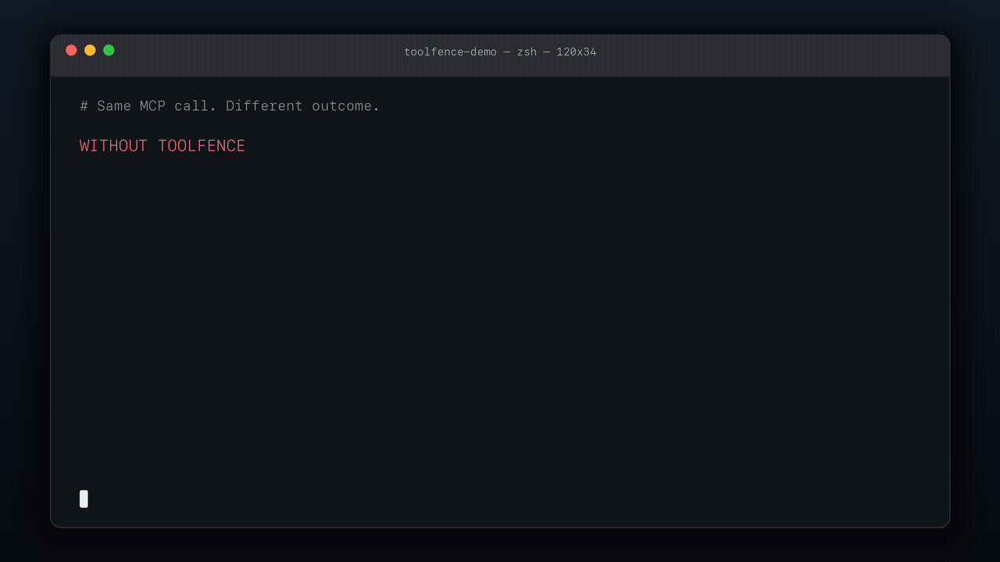
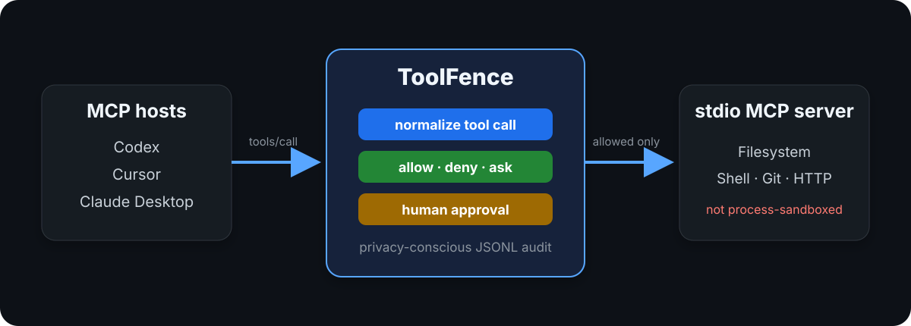

# ToolFence

[](https://github.com/jiangkoumo/toolfence/actions/workflows/ci.yml)
[](https://www.npmjs.com/package/toolfence-mcp)
[](https://www.npmjs.com/package/toolfence-mcp)
[](LICENSE)

**A vendor-neutral policy firewall for MCP tool calls.**

ToolFence enforces one testable least-privilege policy between AI agents and stdio MCP servers. With a conservative default (`ask` or `deny`), the same rules can be used from Codex, Cursor, or Claude Desktop: safe calls pass, dangerous or unrecognized calls stop before upstream execution, and uncertain calls require human approval—without changing the MCP host or server.

- **Portable policy:** keep resource and command rules independent of a single Agent platform.
- **Deterministic enforcement:** normalize tool calls, give `deny` precedence, and surface unknown or ambiguous actions for conservative policy handling.
- **Auditable evidence:** record privacy-conscious decisions and result hashes without storing raw arguments or results.

## Same MCP call. Different outcome.



The animation sends the same `.env` read to the official Filesystem MCP Server twice:

- without ToolFence, the server returns the explicitly synthetic value `OPENAI_API_KEY=TF_DEMO_ONLY`;
- with ToolFence, the `protect-secrets` rule denies the call before upstream execution;
- the demo verifies that the denied response and audit log do not contain the synthetic secret.

These are real JSON-RPC processes and assertions, not hard-coded policy results. [Run the comparison or regenerate the GIF](docs/demo.md).

## Protect a Filesystem MCP server in three minutes

The npm package is `toolfence-mcp`; the installed command is `toolfence`.

```bash
npm install -g toolfence-mcp
cd /absolute/path/project
toolfence policy init --list-recipes
toolfence policy init --recipe filesystem
toolfence policy check --policy ./toolfence.yaml
```

The npm command is the recommended one-step install. Each GitHub Release also attaches the same installable `.tgz`; after downloading it, run `npm install -g ./toolfence-mcp-<version>.tgz`. The automatically generated GitHub “Source code” archives are repository snapshots, not installers.

Wrap a local Filesystem MCP server:

```bash
toolfence wrap \
  --policy ./toolfence.yaml \
  --server filesystem \
  --workspace "$PWD" \
  -- npx -y @modelcontextprotocol/server-filesystem "$PWD"
```

The generated policy is conservative and never replaces an existing file. Explore pre-tested policy templates in [`examples/recipes/`](examples/recipes/) for Filesystem, GitHub, Fetch, SQLite, PostgreSQL, and Git.

Connect the wrapper to your MCP host with one command:

```bash
# Preview or write configuration for your favorite host
toolfence host init --host cursor --write
toolfence host init --host claude-desktop --write
toolfence host init --host codex --write
toolfence host init --host claude-code --write
```

| Host | Guide or reference | Quick command |
| --- | --- | --- |
| Cursor | [`docs/cursor.md`](docs/cursor.md) | `toolfence host init --host cursor --write` |
| Claude Desktop | [`docs/claude-desktop.md`](docs/claude-desktop.md) | `toolfence host init --host claude-desktop --write` |
| Codex | [`docs/codex.md`](docs/codex.md) | `toolfence host init --host codex --write` |
| Claude Code | [Claude Code MCP reference](https://docs.anthropic.com/en/docs/claude-code/mcp) | `toolfence host init --host claude-code --write` |

## What ToolFence adds

- **Semantic policies & recipes:** normalize common Filesystem, Shell, Git, and HTTP tool calls into operations such as `fs.read`, `shell.exec`, `git.write`, and `net.request`. Choose from built-in recipes or customize matches for paths, commands, hosts, and HTTP methods.
- **Output Secret Redaction (DLP):** automatically detect and redact leaked API keys (OpenAI, Anthropic, GitHub, AWS), JWTs, and private keys from tracked upstream tool outputs before reaching the agent, without intentionally recording raw payloads in the audit log.
- **Deterministic enforcement:** `deny` overrides other matches, multi-resource requests are evaluated as a unit, and unknown or ambiguous actions normalize conservatively for policy evaluation.
- **Human approval:** use an authenticated local Broker for one-time or session decisions; session approvals are bound to the tool Schema and are invalidated when that Schema changes.
- **Privacy-conscious auditing:** record tool identity, affected resources, policy decisions, and result hashes without storing raw arguments or results.
- **Policies you can test:** generate, validate, explain, and regression-test YAML policies from the CLI.

## Where ToolFence fits

| Layer | What it controls | What it does not control |
| --- | --- | --- |
| MCP host approvals | Host-specific user prompts and tool settings | A reusable policy shared across different hosts |
| **ToolFence** | Normalized tool calls, deterministic YAML policy, Schema-bound approval, privacy-conscious audit | Direct actions taken by the upstream server process |
| OS sandbox or container | Process, filesystem, environment, and network access | Semantic intent of an MCP tool call by itself |

ToolFence is designed to complement host approvals and OS isolation. It is not a replacement for either.



## Status

Version 0.4.0 establishes the cross-platform enforcement baseline: a platform-neutral Broker IPC abstraction with user-scoped Windows Named Pipe support, private credential storage enforcement without misleading POSIX mode emulation, a versioned action model (`1.0`) with conservative downgrade rules, a versioned audit evidence schema (`v1`) correlating Host, protocol revision, tool fingerprints, and non-forwarding evidence, and Host-native tool bypass disclosures for Codex, Cursor, Claude Code, and Claude Desktop. This builds on the reproducible protocol conformance evidence, cancellation-safe Broker handling, precise approval and dispatch evidence, MCP `isError` result semantics, and conservative AgentTape integration.

ToolFence is **not a sandbox for a malicious MCP server process**: the upstream process still runs with the current user's operating-system permissions.

Because ToolFence launches user-configured processes and mediates Shell, Git, and HTTP capabilities, the npm package is transparently declared as dual-use. See [DISCLOSURE](DISCLOSURE) for the intended legitimate use and security boundary.

## Human approval

ToolFence reserves stdout for MCP JSON-RPC messages. Diagnostics and upstream stderr stay on stderr. Start the per-user Broker and approval terminal in separate terminals:

```bash
toolfence broker
toolfence approvals
```

`wrap` uses the Broker by default. If it is missing, incompatible, unauthenticated, disconnected, or times out, an `ask` decision fails closed. Use `--approval tty` only when direct `/dev/tty` approval is desired. `toolfence status` verifies Broker connectivity, protocol version, and Socket permissions.

Diagnose a local setup before connecting it to an MCP host:

```bash
toolfence doctor --policy ./toolfence.yaml
toolfence doctor --policy ./toolfence.yaml -- \
  npx -y @modelcontextprotocol/server-filesystem "$PWD"
toolfence doctor --policy ./toolfence.yaml --json
```

`doctor` checks the Node.js runtime, validates the selected Policy, authenticates a running Broker and verifies its private runtime permissions, and optionally starts the explicit command after `--` for a short startup probe. Warnings identify checks that were not requested or services that are not currently running; failed checks exit non-zero.

For scripts or an external approval UI, list the privacy-safe queue as JSON or resolve one known approval ID without a prompt:

```bash
toolfence approvals --json
toolfence approvals --id <approval-id> --decision allow-once
toolfence approvals --id <approval-id> --decision allow-session
toolfence approvals --id <approval-id> --decision deny
```

## Policy

```yaml
version: 1
default: ask

rules:
  - id: deny-dotenv
    effect: deny
    operations: [fs.read, fs.write]
    resources: ["**/.env", "**/.env.*"]

  - id: allow-workspace-read
    effect: allow
    operations: [fs.read]
    resources: ["${workspace}/**"]

  - id: allow-tests
    effect: allow
    operations: [shell.exec]
    commands:
      - [npm, test]

  - id: allow-git-inspection
    effect: allow
    operations: [git.read]

  - id: allow-read-api
    effect: allow
    operations: [net.request]
    hosts: ["api.example.com", "*.internal.example.com"]
    methods: [GET, HEAD]
```

Rules are evaluated deterministically:

1. Every matching `deny` rule overrides all other matches. A deny resource rule matches when any requested resource is protected.
2. Otherwise, the first matching rule wins.
3. If nothing matches, `default` is used.

Allow and ask resource rules require every requested resource to match, so a multi-file call cannot use one allowed path to carry an unauthorized path.

Filesystem paths are canonicalized before matching, including existing symbolic links. Exact argv matching is used for allowed commands; compound or quoted shell strings are not treated as safe argv and, without an explicit matching rule, require approval instead of inheriting `default: allow`.

Current operations are `fs.read`, `fs.write`, `fs.delete`, `shell.exec`, `git.read`, `git.write`, `git.remote`, `net.request`, and `unknown`. Ambiguous Git commands, invalid URLs, and unrecognized tools fall back through `shell.exec` or `unknown` instead of being treated as a known safe action.

The AgentTape integration is normalized conservatively only for the `agenttape`, `agenttape-fenced`, and `agenttape_fenced` server aliases: `list_tapes`, `inspect_tape`, and `fork_run` are `fs.read`; `save_regression` is `fs.write` scoped to `workspaceRoot/tests/agenttape/<filename>`. The same tool names from other servers and unrecognized AgentTape tools remain `unknown`.

As of `v0.3.2`, an unmatched unknown, ambiguous, or malformed action requires approval instead of inheriting `default: allow`, while an explicit matching rule can still authorize it. Users remaining on `v0.3.1` should use `ask` or `deny` as their default.

Output secret redaction is enabled by default for tracked tool results, including successful results and JSON-RPC errors. Set `redactSecrets: false` at the top level of a policy only when exact upstream output compatibility is required. Detection is best-effort and covers known token formats, private keys, textual secret assignments, and structured string fields with sensitive names; it does not replace destination controls or process isolation.

## Policy development

```bash
toolfence policy init [--policy ./toolfence.yaml]
toolfence policy check --policy ./examples/policy.yaml
toolfence policy explain --policy ./examples/policy.yaml --action ./action.json
toolfence policy test --policy ./examples/policy.yaml --cases ./policy-cases.yaml
```

`init` creates a conservative policy without overwriting an existing file. `check` validates YAML, strict Schema rules, variables, duplicate IDs, and invalid network-field combinations. `explain` prints matched rules and the final decision. `test` runs declarative cases and exits non-zero on any mismatch.

## Audit log

The default audit file is `.toolfence/audit.jsonl` under the workspace. It records operation names, affected paths, tool identity, final policy decisions, and SHA-256 hashes of upstream results. Decision/result records carry `proxyRunId` and `clientSessionId`; approval decisions additionally carry `approvalId` and the actual `allow-once`, `allow-session`, or `deny` resolution. A denied or timed-out call records `dispatch: not-forwarded`. Allowed decisions do not claim successful dispatch before the upstream write; a correlated result is the evidence that an upstream response returned. Raw tool arguments, command arguments, and raw results are intentionally omitted to reduce secret leakage.

Use `--audit /path/to/audit.jsonl` to select a different path.

Inspect the default or a selected audit log without storing additional data:

```bash
toolfence audit summary
toolfence audit summary --audit /path/to/audit.jsonl --json
toolfence audit tail --lines 20
toolfence audit tail --audit /path/to/audit.jsonl --lines 50 --json
```

`summary` reports decision effects, result errors, and operation counts. `tail` returns the newest validated records using only the documented privacy-safe JSONL fields.

## Security boundary

ToolFence reduces accidental or prompt-injected tool misuse when the tool call crosses its stdio proxy. It does not prevent the upstream server process from directly reading files, environment variables, or the network. Process isolation, environment filtering, and network controls require a separate sandbox layer.

Additional current limitations:

- stdio transport only
- local Broker support is POSIX-only; Windows remains non-interactive and fail-closed
- JSON-RPC batch messages are rejected
- output secret detection is best-effort; unrecognized or encoded secret formats may still pass through
- an HTTP MCP adapter must expose a redirect destination (for example as `redirectUrl`) for ToolFence to re-evaluate it

## Protocol compatibility

ToolFence's proxy transport is stdio. The supported stdio protocol revisions and their evidence live in the machine-readable [`conformance/matrix.json`](conformance/matrix.json); the dated run results are recorded in `conformance/report.json`, regenerated by `npm run conformance` and enforced by `npm run release:check`.

Every matrix row and Doctor report uses one of four statuses:

- **supported** — the row passes the shared conformance corpus (`conformance/corpus.mjs`) in a dated report;
- **experimental** — allowed but not yet corpus-verified;
- **unverified** — no current passing evidence;
- **unsupported** — not implemented (for example Windows interactive Broker and Streamable HTTP).

Unverified and unsupported combinations never expand permissions: policy decisions are deterministic and protocol-revision metadata is neutral for every protocol shape, an unknown or ambiguous action cannot inherit `default: allow`, and a request advertising an unverified protocol revision produces the same decision and forwarding as the verified revision. Conformance fixtures prove transparent pass-through of `server/discover`, per-request `_meta`, list cache metadata, and MRTR; they do not mean ToolFence implements those higher-level capabilities.

## Development

The architecture, threat model, historical implementation baselines, and current release gates are maintained in the [development guide](DEVELOPMENT.md). Public priorities and good first contribution candidates are in the [roadmap](ROADMAP.md). Mutual AgentTape × ToolFence dogfooding follows the mirrored [alignment contract](docs/AGENTTAPE_TOOLFENCE_ALIGNMENT.md).

```bash
npm run typecheck
npm test
npm run test:coverage
npm run build
npm pack --dry-run
npm audit --omit=dev
```

The full validation strategy is in [TESTING.md](TESTING.md), and the release/security review record is in [REVIEW.md](REVIEW.md). See [CONTRIBUTING.md](CONTRIBUTING.md), [SECURITY.md](SECURITY.md), [CHANGELOG.md](CHANGELOG.md), and [RELEASING.md](RELEASING.md) before contributing, reporting a vulnerability, or publishing a release.

## License

MIT
